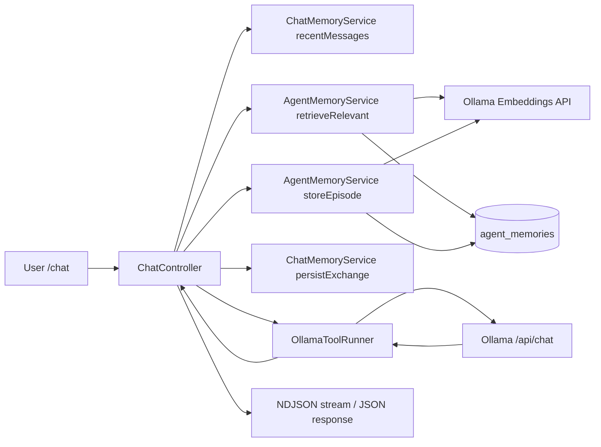
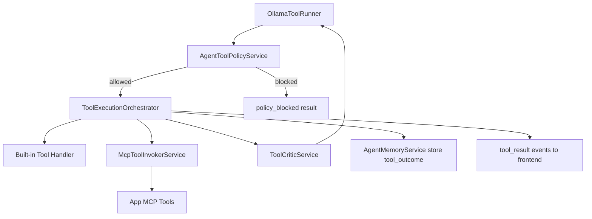

# Agentic AI Orders Assistant

A Laravel + Inertia React application that provides an **agentic AI assistant** for operations workflows: querying and updating orders, generating financial reports, managing report tasks, and sending WhatsApp messages.

## What This Project Can Do

### 1. Conversational AI Assistant (Ollama)
- Chat UI at `/chat`.
- Supports standard response mode and streaming mode (`/chat/stream`).
- Persists conversation context per authenticated user.
- Injects relevant long-term memory snippets (episodic + semantic lexical retrieval) into the system context before execution.
- Loads conversation history in the existing app sidebar and opens a thread only when that session is clicked.
- Prevents accidental cross-session mixing by starting a new conversation when no `conversation_id` is selected.
- Tracks context-window usage from model responses.

### 2. Tool Calling Over Business Data
The AI can call tools to interact with `sheet_orders` and related workflows:
- `list_orders`: search/filter/paginate orders
- `get_order`: fetch a specific order by id/order number
- `create_order`: create a new order
- `edit_order`: update existing order fields
- `financial_report`: compute overall revenue/order summaries and breakdowns
- `merchant_report`: compute merchant-focused performance summaries and rankings
- `call_center_daily_report`: call center daily summary for scheduled/delivered coded orders
- `call_center_monthly_report`: call center monthly summary with status grouping
- `create_report_task`: start a multi-merchant report workflow
- `get_report_task_status`: inspect workflow progress
- `send_whatsapp_message`: send outbound WhatsApp messages
- `setup_integration`: scaffold WhatsApp provider integrations
- `scaffold_mcp_tool`: generate new MCP tool boilerplate
- Runtime tool registry discovers MCP tools dynamically and exposes them to the model without hardcoding.

### 2.1 Autonomous Agent Runtime (New)
- **Hard safety/policy layer**: risk-classifies tools and blocks high-risk actions unless explicitly confirmed (`confirmed=true`).
- **Planner pass before execution**: generates a structured plan (goal, steps, dependencies, success criteria, risk tags) and injects it into the run context.
- **Execution orchestrator**: wraps tool calls with retries, backoff, simple alternative-argument strategy, and escalation when unrecoverable.
- **Critic loop**: evaluates tool outputs (delivery, reporting plausibility, task creation integrity) and feeds critique telemetry back into the stream.
- **Long-term memory service**: stores tool outcomes and conversation episodes for future retrieval.
- **Semantic retry for model/schema tooling**: retries `model_schema_workspace` with corrected model/table arguments when resolution fails (for example `*_messages` table names).
- **Fuzzy model/table resolution**: workspace resolver now maps close model/table names instead of requiring strict exact names.
- **Domain mismatch guard**: for WhatsApp-intent requests, the runner blocks unrelated fallback tools (for example sheet/order/report drift) and keeps execution in the correct domain.
- **Empty-final-response summary fallback**: when tools succeed but the model emits no final text, the runner synthesizes a concise result summary instead of a generic placeholder line.
- **Generic tabular UI rendering**: the chat UI now auto-renders table-like tool results from any array-of-object payload, reducing per-tool frontend work for newly generated tools.

### 3. Reporting Types (Separated)
- **Financial Report** (`financial_report` + `/reports/financial/export`)
  - Global financial scope over delivered/remitted orders.
  - Supports merchant/country/city/agent/date filters.
- **Merchant Report** (`merchant_report`)
  - Merchant-focused performance report (merchant ranking, shares, top products) with explicit status filtering.
  - Keeps merchant analysis separate from global financial summary.
- **Call Center Reports** (`call_center_daily_report`, `call_center_monthly_report`)
  - Daily and monthly call-center-specific reporting.
  - Kept separate from financial and merchant reporting tools.

### 4. Financial Reporting Export
- Export endpoint: `/reports/financial/export`
- Supports filters: merchant, country, city, agent, start/end date, date field.
- Downloads XLSX (when Laravel Excel is available) or CSV fallback.

### 5. Report Workflow Automation
- Creates task files for multi-step merchant workflows.
- Step confirmation endpoint updates order statuses and agent remittance state.
- Provides per-merchant report download links when completed.
- Report-task ownership is now bound to authenticated `user_id` and enforced on read/confirm.

### 6. WhatsApp Messaging
- Send custom chat messages (`/whatsapp/send-chat`).
- Send templated order message by order id (`/whatsapp/send-message/{id}`).
- Receive inbound/status webhooks (`/whatsapp/webhook`).
- Provider abstraction supports Meta, Twilio, Africa's Talking, and custom APIs.

### 7. Background Task Scheduling
- Create and monitor assistant-created tasks at `/tasks`.
- Supports `immediate`, `one_time`, `recurring`, and `event_triggered` task types.
- One-time tasks are validated server-side: `run_at` must be a valid **future** datetime.
- Relative one-time schedule intent (for example "today at 12:20pm") is normalized defensively:
  if parsed time is already in the past, the backend shifts to the next valid occurrence.
- Task list now includes status filters for `scheduled`, `queued`, `running`, `completed`, and `failed`.
- `scheduled` maps to queued/pending tasks so future jobs are visible before execution.

### 8. Auth + Security Features
- Laravel Fortify auth flows.
- Email verification and optional two-factor auth settings.
- Authenticated/verified route protection for core app features.

## Workflow Diagrams

### 1) Chat + Long-Term Memory Workflow



### 2) Tool Execution + Policy Workflow



### 3) Task Scheduling Workflow

```mermaid
flowchart LR
    U[User asks schedule/background] --> OR[OllamaToolRunner]
    OR --> CT[create_task tool]
    CT --> TS[TaskService]
    TS --> DB[(tasks/task_runs/task_logs)]
    TS --> Q[Queue: RunTaskJob]
    Q --> EX[Task execution]
    EX --> DB
    UI[/tasks and /tasks/{id}/stream/] --> DB
```

### 4) Reporting Workflow

```mermaid
flowchart LR
    U[Reporting request] --> OR[OllamaToolRunner]
    OR --> FR[financial_report]
    OR --> MR[merchant_report]
    OR --> CCR[call_center_daily/monthly_report]
    FR --> DB[(sheet_orders + related tables)]
    MR --> DB
    CCR --> DB
    U --> FE[/reports/financial/export]
    FE --> DB
    FE --> XLS[XLSX/CSV download]
```

### 5) WhatsApp Messaging Workflow

```mermaid
flowchart LR
    U[Send message request] --> OR[OllamaToolRunner]
    OR --> SWT[send_whatsapp_message tool]
    SWT --> WS[WhatsappMessageSender]
    WS --> API[Provider API: meta/twilio/africastalking/custom]
    API --> WB[/whatsapp/webhook]
    WB --> DB[(whatsapp + status data)]
```

## Tech Stack

- **Backend:** Laravel 12, PHP 8.2+
- **Frontend:** React 19 + TypeScript + Inertia.js + Vite
- **AI Runtime:** Ollama chat API
- **Messaging:** WhatsApp provider abstraction
- **Exports:** `maatwebsite/excel`

## Core Routes

- `/dashboard`
- `/chat`
- `POST /chat/message`
- `POST /chat/stream`
- `GET /reports/financial/export`
- `GET /report-tasks/{taskId}`
- `POST /report-tasks/{taskId}/confirm`
- `POST /whatsapp/send-chat`
- `POST /whatsapp/send-message/{id}`
- `POST /whatsapp/webhook`
- `GET /tasks`
- `GET /tasks/{task}`
- `GET /tasks/{task}/stream`
- `POST /api/tasks`

## Local Setup

```bash
composer install
npm install
cp .env.example .env
php artisan key:generate
php artisan migrate
npm run dev
php artisan serve --host=127.0.0.1 --port=8000
```

Open: `http://127.0.0.1:8000`

## Important Environment Variables

```env
APP_URL=http://127.0.0.1:8000
APP_TIMEZONE=UTC

OLLAMA_BASE_URL=http://127.0.0.1:11434
OLLAMA_MODEL=your-model-name
OLLAMA_TIMEOUT=120
OLLAMA_EMBEDDING_MODEL=qwen3-embedding:0.6b
OLLAMA_EMBEDDING_TIMEOUT=20
OLLAMA_ENABLE_DYNAMIC_TOOLS=true

WHATSAPP_PROVIDER=meta|twilio|africastalking|custom
# ...provider-specific keys...
```

## Embeddings Setup (Recommended)

This project supports semantic memory retrieval through Ollama embeddings.

1. Install an embedding model locally:

```bash
ollama pull qwen3-embedding:0.6b
```

2. Configure your `.env`:

```env
OLLAMA_EMBEDDING_MODEL=qwen3-embedding:0.6b
OLLAMA_EMBEDDING_TIMEOUT=20
```

3. Reload config after editing `.env`:

```bash
php artisan optimize:clear
```

## Embeddings Verification

Use these checks to confirm real embeddings are active:

1. Confirm config value:

```bash
php artisan tinker
config('services.ollama.embedding_model')
```

Expected: `qwen3-embedding:0.6b`

2. Confirm stored memory rows are using Ollama embeddings:

```sql
select id, metadata, created_at
from agent_memories
order by created_at desc
limit 10;
```

Expected in `metadata`:
- `embedding_kind: "ollama"`
- `embedding_model: "qwen3-embedding:0.6b"`

If you see `embedding_kind: "fallback_hash"`, semantic embeddings were not used for those rows.

3. Monitor runtime errors:

```bash
tail -f storage/logs/laravel.log
```

Look for:
- `Embedding connection failed...`
- `Embedding generation failed...`

## Embeddings Observability

Use these Artisan commands to measure memory quality and latency.

1. Memory health snapshot (coverage + fallback ratio):

```bash
php artisan ai:memory:health
```

Optional:

```bash
php artisan ai:memory:health --user-id=1
php artisan ai:memory:health --json
```

Health metrics include:
- total memories
- recent writes/accesses
- ollama vs fallback embedding counts
- embedding coverage percent
- average content length
- top scopes

2. Lightweight benchmark (store + retrieve latency and hit rate):

```bash
php artisan ai:memory:benchmark --user-id=1 --iterations=10 --limit=4
```

Optional:

```bash
php artisan ai:memory:benchmark --user-id=1 --query="summarize my prior order updates" --iterations=20 --json
```

Benchmark output includes:
- hit-rate percent
- average hits per retrieval
- store latency (avg/p95 ms)
- retrieval latency (avg/p95 ms)
- total round latency (avg/p95 ms)

## Bootstrap Essentials (Do Not Delete)

To keep autonomous tool discovery/scaffolding working, keep these files/services in place:

- `app/Services/OllamaToolRunner.php`
- `app/Services/ToolExecutionOrchestrator.php`
- `app/Services/AgentPlannerService.php`
- `app/Services/AgentToolPolicyService.php`
- `app/Services/ToolCriticService.php`
- `app/Services/McpToolInvokerService.php`
- `app/Services/DynamicToolRegistryService.php`
- `app/Mcp/Tools/ModelSchemaWorkspaceTool.php`
- `app/Mcp/Tools/ScaffoldMcpTool.php`
- `app/Mcp/Servers/OrdersServer.php`
- `app/Http/Controllers/ChatController.php`
- `routes/ai.php`
- `config/services.php` (`ollama.*` settings)
- `resources/ai/skills/` (keep root path; generated subfolders can be recreated)

Safe cleanup target: generated domain tools/skills (`List*RecordsTool`, `Get*RecordTool`, and generated skill subfolders).

## Notes

- Use a single host consistently (`127.0.0.1` **or** `localhost`) to avoid CSRF/session issues.
- Set `APP_TIMEZONE` to your operational timezone (for example `Africa/Nairobi`) so task scheduling and "today/tomorrow" interpretations are correct.
- After changing timezone/config values, run `php artisan optimize:clear`.
- If MySQL is unavailable in local development, use file-based session/cache drivers.
- Delayed tasks require a healthy DB queue + active worker (`php artisan queue:work`).
- Some domain tables/models (orders, whatsapp, etc.) depend on your existing DB schema and data.
