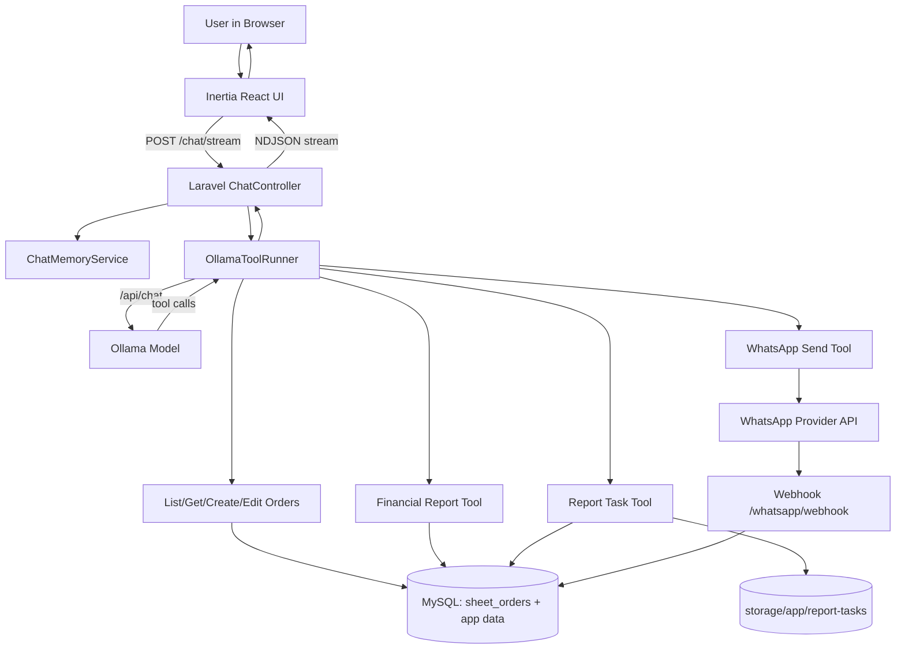

# Agentic AI Orders Assistant

A Laravel + Inertia React application that provides an **agentic AI assistant** for operations workflows: querying and updating orders, generating financial reports, managing report tasks, and sending WhatsApp messages.

## What This Project Can Do

### 1. Conversational AI Assistant (Ollama)
- Chat UI at `/chat`.
- Supports standard response mode and streaming mode (`/chat/stream`).
- Persists conversation context per authenticated user.
- Tracks context-window usage from model responses.

### 2. Tool Calling Over Business Data
The AI can call tools to interact with `sheet_orders` and related workflows:
- `list_orders`: search/filter/paginate orders
- `get_order`: fetch a specific order by id/order number
- `create_order`: create a new order
- `edit_order`: update existing order fields
- `financial_report`: compute revenue/order summaries and breakdowns
- `create_report_task`: start a multi-merchant report workflow
- `get_report_task_status`: inspect workflow progress
- `send_whatsapp_message`: send outbound WhatsApp messages
- `setup_integration`: scaffold WhatsApp provider integrations
- `scaffold_mcp_tool`: generate new MCP tool boilerplate

### 3. Financial Reporting
- Export endpoint: `/reports/financial/export`
- Supports filters: merchant, country, city, agent, start/end date, date field.
- Downloads XLSX (when Laravel Excel is available) or CSV fallback.

### 4. Report Workflow Automation
- Creates task files for multi-step merchant workflows.
- Step confirmation endpoint updates order statuses and agent remittance state.
- Provides per-merchant report download links when completed.

### 5. WhatsApp Messaging
- Send custom chat messages (`/whatsapp/send-chat`).
- Send templated order message by order id (`/whatsapp/send-message/{id}`).
- Receive inbound/status webhooks (`/whatsapp/webhook`).
- Provider abstraction supports Meta, Twilio, Africa's Talking, and custom APIs.

### 6. Auth + Security Features
- Laravel Fortify auth flows.
- Email verification and optional two-factor auth settings.
- Authenticated/verified route protection for core app features.

## Flow Diagram



## Tech Stack

- **Backend:** Laravel 12, PHP 8.2+
- **Frontend:** React 19 + TypeScript + Inertia.js + Vite
- **AI Runtime:** Ollama chat API
- **Messaging:** WhatsApp provider abstraction
- **Exports:** `maatwebsite/excel`

## Core Routes

- `/dashboard`
- `/chat`
- `POST /chat/message`
- `POST /chat/stream`
- `GET /reports/financial/export`
- `GET /report-tasks/{taskId}`
- `POST /report-tasks/{taskId}/confirm`
- `POST /whatsapp/send-chat`
- `POST /whatsapp/send-message/{id}`
- `POST /whatsapp/webhook`

## Local Setup

```bash
composer install
npm install
cp .env.example .env
php artisan key:generate
php artisan migrate
npm run dev
php artisan serve --host=127.0.0.1 --port=8000
```

Open: `http://127.0.0.1:8000`

## Important Environment Variables

```env
APP_URL=http://127.0.0.1:8000

OLLAMA_BASE_URL=http://127.0.0.1:11434
OLLAMA_MODEL=your-model-name
OLLAMA_TIMEOUT=120

WHATSAPP_PROVIDER=meta|twilio|africastalking|custom
# ...provider-specific keys...
```

## Notes

- Use a single host consistently (`127.0.0.1` **or** `localhost`) to avoid CSRF/session issues.
- If MySQL is unavailable in local development, use file-based session/cache drivers.
- Some domain tables/models (orders, whatsapp, etc.) depend on your existing DB schema and data.
